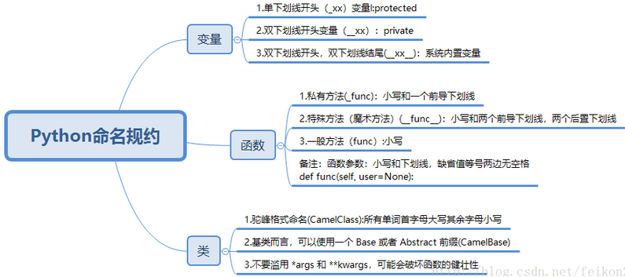

# Python 变量命名规则——PyCharm默认命名规则
* 1. 普通变量/普通函数/模块名/程序包  
字母全小写，分割单词用`_` ，例如：batch_size  
* 2.类名  
每个单词首字母大写，例如：HattedDataset  
* 3. 常量/全局变量   
字母全大写，分割单词用`_` ，例如：COLOR_WRITE  
* 4.下划线开头  
字母小写，分割单词用`_`  
实例变量：

参考：  https://www.cnblogs.com/liuyanhang/p/11099897.html;    https://www.cnblogs.com/zhangyafei/p/10429426.html   
